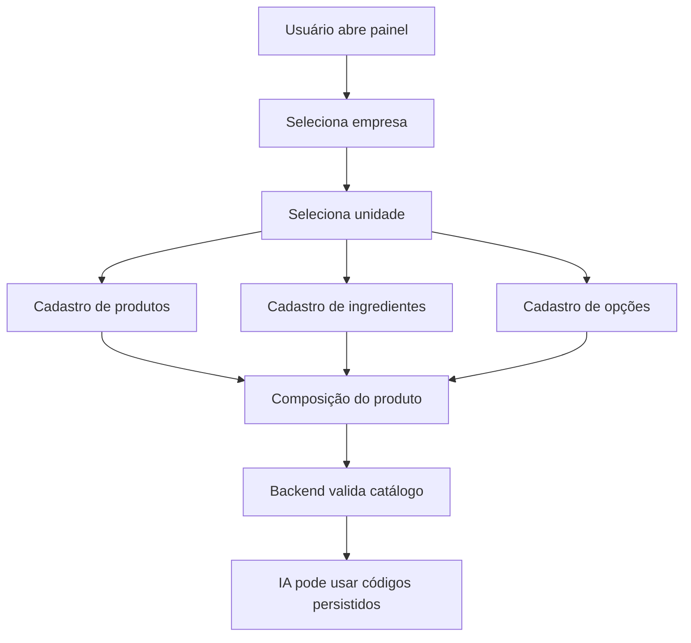
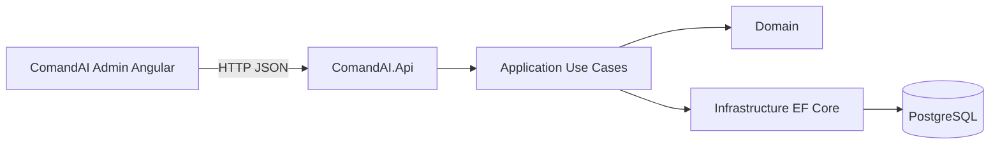

# Diagramas — Frontend Admin

## Fluxo de cadastro do catálogo


```mermaid
flowchart TD
    A[Usuário abre painel] --> B[Seleciona empresa]
    B --> C[Seleciona unidade]
    C --> D[Cadastro de produtos]
    C --> E[Cadastro de ingredientes]
    C --> F[Cadastro de opções]
    D --> G[Composição do produto]
    E --> G
    F --> G
    G --> H[Backend valida catálogo]
    H --> I[IA pode usar códigos persistidos]
```

## Integração frontend/backend


```mermaid
flowchart LR
    A[ComandAI Admin Angular] -->|HTTP JSON| B[ComandAI.Api]
    B --> C[Application Use Cases]
    C --> D[Domain]
    C --> E[Infrastructure EF Core]
    E --> F[(PostgreSQL)]
```
```
